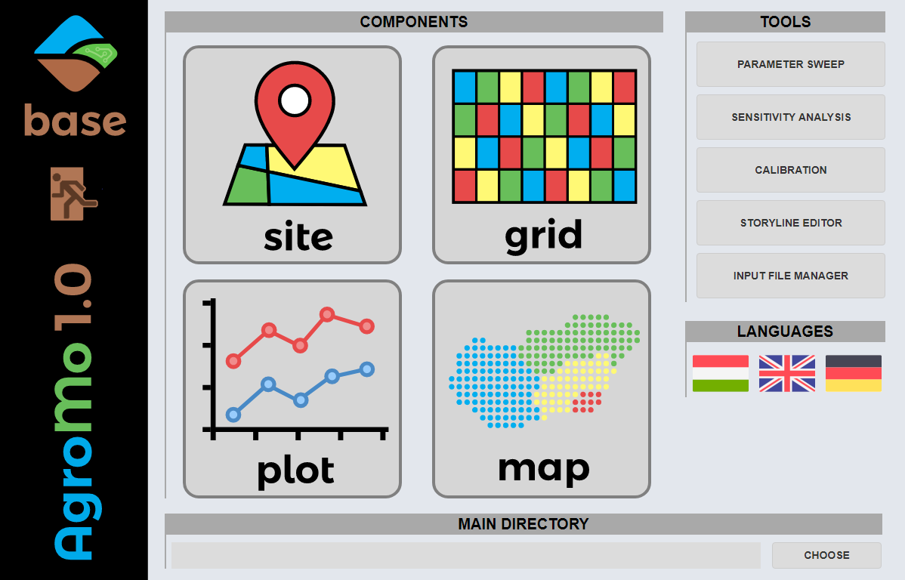
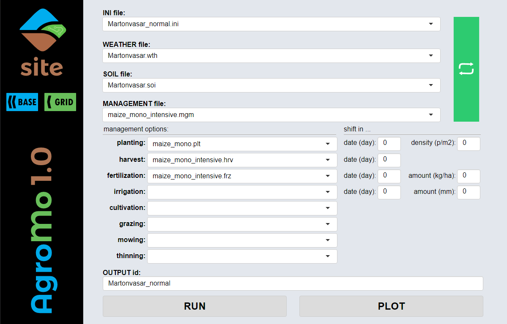
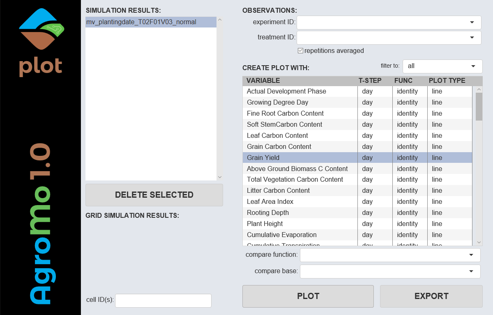
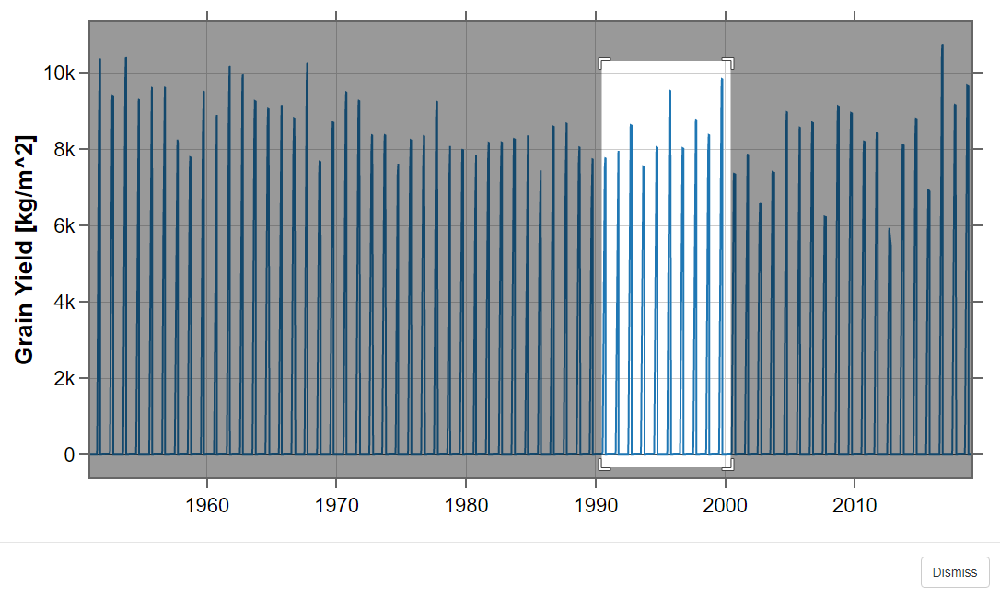
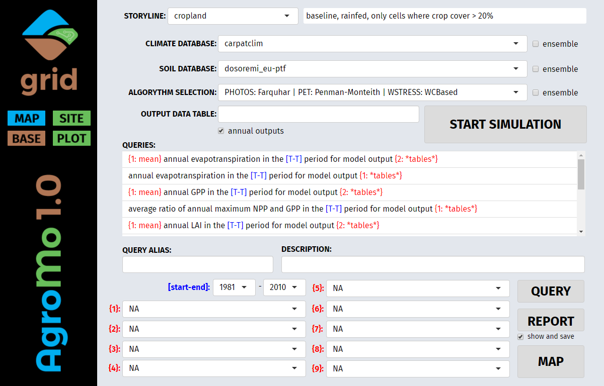
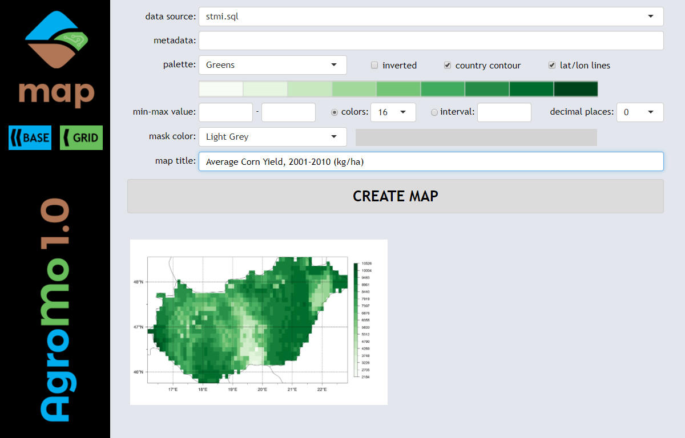
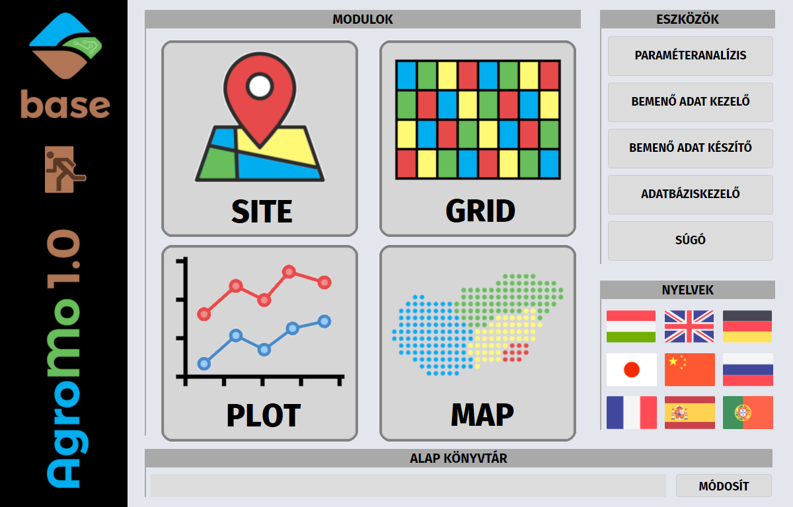
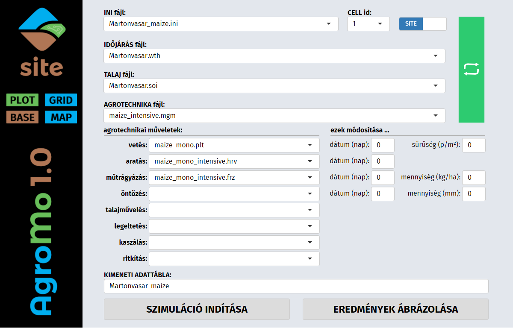
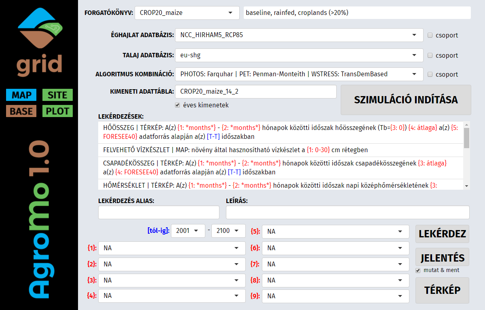
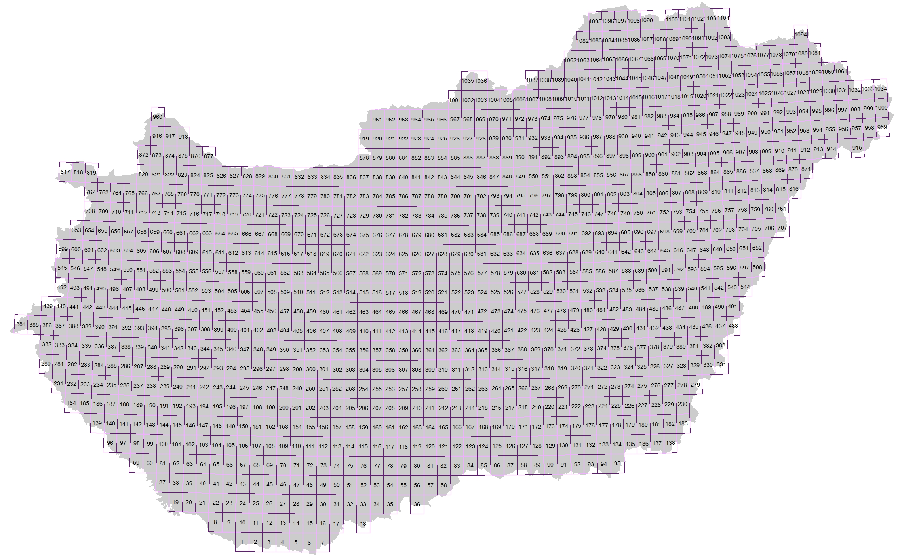

# AgroMo project

 &emsp;    

---

# English version 

## Introduction

AgroMo is an Integrated Assessment and Modelling software that integrates 4M (Fodor et al. 2014) a CERES based crop model, the Biome-BGCMuSo (Hidy et al. 2016) biogeochemical and a simple agro-economical model in order to support decision makers at multiple scales. Biome-BGCMuSo v6.1 is a detailed biogeochemical model extended with many features from the 4M crop model, thus merges many capabilities from both model families. The hybrid model is capable of simulating all major land use types, any kind of land use changes, a large number of agro-management operations, as well as the full water, carbon and nitrogen cycle of the plant-soil system including its GHG (greenhouse gas) balance. 

- [x] Denotes the options/functions that are already available.
- [ ] Denotes the options/functions that are under construction.

## Install AgroMo

AgroMo GUI uses the freely available Fira Sans font family. Please, install the font in order to obtain proper outlook. The font is available [here](https://fonts.google.com/specimen/Fira+Sans).

### Using AgroMo Launcher

- [x] AgroMo does not require installation, actually. Create a folder for your AgroMo: e.g. 'D:\AgroMo' and download AgroMo Launcher into this folder.
- [x] Start AgroMo_LAUNCH.exe in your AgroMo folder, select the 'Install / Full Update' option and click the [INSTALL/UPDATE AGROMO] button.

### [Direct link to the Launcher](https://owncloud.atk.hu/index.php/s/7T5GWv1wYqqlJFE/download)

## AgroMo User Interface

A graphical user interface (GUI) has been developed for providing easy and user friendly access to the functions of the AgroMo system.

- [x] AgroMo starts with .\AgroMo\AgroMo_Launch.exe and then by clicking the [LAUNCH AGROMO] button.

### AgroMo Base

- [ ] Choose/change the main directory where your data files are located (in the required [subdirectory system](img/AgroMo_File_System.pdf)) by clicking the [MODIFY] button. The default location is the AgroMo\data folder.
- [x] Run the model for a specific site/plot by clicking the [SITE] button.
- [x] Create plots of the simulation results by clicking the [PLOT] button.
- [x] Make gridded model runs by clicking the [GRID] button.
- [x] Present the results of a gridded simulation on a map by clicking the [MAP] button.
- [x] Carry out Sensitivity analysis, Parameter sweep or Parameter calibration by clicking the [PARAMETER ANALYSIS] button. 
- [ ] Import weather and soil data from international databases into local input files by clicking the [INPUT IMPORT] button.
- [x] Create storyline and corresponding input files for gridded model runs by clicking the [INPUT CREATOR] button.
- [x] Select GUI language by click one of the flag icons to the right. Hungarian, English, German and Chinese versions are available at the moment.
- [x] Exit AgroMo by clicking the EXIT icon on the banner to the left.

### AgroMo Site

- [x] The dropdown menus display the files, only with the prescribed extension, of the corresponding directories within the prescribed input folder system:
  - INI files (extension: .ini): .\input\initialization\site\
  - WEATHER files (extension: .wth): .\input\weather\site\
  - SOIL files (extension: .soi): .\input\soil\site\
  - MANAGEMENT files (extension: .mgm): .\input\management\site\
     - planting management option file (extension: .plt): .\input\management\site\planting\
     - harvest management option file (extension: .hrv): .\input\management\site\harvest\
     - fertilization management option file (extension: .frz): .\input\management\site\fertilization\
     - irrigation management option file (extension: .irr): .\input\management\site\irrigation\
     - cultivation management option file (extension: .cul): .\input\management\site\cultivation\
     - grazing management option file (extension: .grz): .\input\management\site\grazing\
     - mowing management option file (extension: .mow): .\input\management\site\mowing\
     - thinning management option file (extension: .thn): .\input\management\site\thinning\
  - PLANT specific input files (extension: .epc; folder: .\input\plant\) are referred to in the planting files

- [x] When selecting an INI file the WEATHER, SOIL and MANAGEMENT files that are referred to in the INI file are automatically selected from the corresponding dropdown menus, but those could be changed freely any time.
- [x] In case new INI, WEATHER, SOIL, MANAGEMENT, etc. files are placed to the corresponding folders of the file system, click the green [REFRESH] button to see the new files in the corresponding dropdown menus.
- [x] When selecting a MANAGEMENT file the management option files that are referred to in the MANAGEMENT file are automatically selected from the corresponding dropdown menus, but those could be changed freely any time.
- [x] The most important parameters of the management options could be changed without accessing the management option file by adjusting the input values using the corresponding textboxes within the 'shift in...' section. Negative values could also be used.
- [x] Give a name to the simulation run in the 'OUTPUT DATA TABLE' textbox. Output data are stored in an SQLite data table using the name defined in the textbox.
- [x] After selecting the desired input files and optionally set up the changes in the 'shift in...' section simulation starts by clicking the [START SIMULATION] button.
- [x] An activity indicator is on while the simulation is running. 
- [x] To see simulation results on graphs click the [PLOT] button.
- [x] Navigate to the [BASE], [GRID] or [MAP] component by clicking the corresponding button on the banner to the left.
- [x] Simulation for a cell of a datagrid can be carried out as if it would be a site in the following way: (1) set the SITE/GRID switch to GRID state, (2) select a GRIDDED DATASET, (3) select a CELL id, (4) click the (green) [REFRESH] button, (5) set the SITE/GRID switch back to SITE state, and (6) select the corresponding INI file (dataset_name+cell_id.ini) for the simulation. 

### AgroMo Plot

- [x] Select a maximum of 5 simulation results from the left side list by clicking the items. Clicking again deselects the item.
- [x] Select output variable(s) from the right side list for presenting them on plot(s).
- [x] Enter an alias for the observed data to be presented on the graph.
- [x] Observed data could be added to the plots by selecting the data file from the corrresponding dropdown lists. NOTE, that data in the observed data tables should be structured according to prescribed rules. Observed (experimental) data should be stored in the '.\AgroMo\data\observation\' folder in a semicolon separated text file with .obs extension. var_id, date and mean (of the observations) values are compulsory for each record, optionally followed by the sd, min and max of the observed values.
- [x] For each selected output variable select:
  - a \|T STEP\| (time step) for which the daily data are to be aggregated into one single value (e.g. for presenting annual values the 'year' option should be selected).
  - a \|FUNC\| (function) that defines the aggregation (e.g. for presenting the final yield for each year the 'max' option should be selected)
  - a \|PLOT TYPE\| 
- [x] Options in the \|time step\|, \|function\| and \|plot type\| columns can be selected via circular menus operated by clicking/scrolling in the corresponding cells.
- [x] Output variables can be filtered accoording to a couple of predefined tags, that may be edited in the centralData.json file located in the '.\AgroMo\app\R-Portable\library\AgroMo\' folder.
- [x] Having all the desired options selected, create plot(s) by clicking the [CREATE PLOT] button.

- [x] Zoom in the graph by selecting an area on the graph while holding down the left mouse button. Zoom out with a double click
- [x] Move the x/y axes by dragging them in the middle (cursor changes) and move the pointer horizontally/vertically.
- [x] Expand/Contract the x/y axes by dragging the end of the axis (cursor changes) and move the pointer horizontally/vertically.
- [x] Hide/Expose a curve on the plot by clicking the corresponding label in the legend.
- [ ] Export plot data into various file formats (e.g. xlsx, csv) by clicking the [EXPORT] button.
- [x] Navigate to the [BASE], [SITE], [GRID] or [MAP] component by clicking the corresponding button on the banner to the left.

### AgroMo Grid

As an INI file controls a site specific simulation, a STORY file defines a whole STORYLINE for a gridded simulation. A STORYLINE is set of INI file sets: comprises a set/series of INI files for every individual cells in the grid. A STORYLINE defines what happens, where and when in the grid inlcuding changes in crop rotation or even land use changes facilitated by INI file changes. In a STORY file all the grid cells are listed and for each cell a series of INI files are listed with an indication of the start and end years when the INI file needs to be activated and deactivated. 

- [x] Select climate database to provide daily weather data for the simulations. 
- [x] Select soil database to provide physical and chemical soil parameters for the simulations. 
- [x] Select algorythm combos defining calculation methods of photosynthesis, potential evapotranspiration and water stress
- [ ] In case an ensemble checkbox is checked simulations are carried out with all available options 
- [x] Provide a name for the output data table in which the simulation results are stored. The results of each simulation are stored in separate data tables of the grid.db SQLite database.
- [x] In case the annual outputs checkbox is checked only annual outputs are stored. In case it is unchecked daily outputs are stored in the data table.
- [x] Click the [START SIMULATION] button to start the simulation. All available (minus one) threads are used for the calculations. 

#### Queries:
- [x] Each item in the QUERIES list stands for an SQL sentence in which key sections were made to be selectable. After choosing a query, set/finalize the SQL sentence by picking items from the available {1}, {2}, etc. dropdown menus. You may select the data table the query is applied for; you may select the time frame you want to focus on; and/or you may select the aggregation function (max, min, mean, etc.) you want to apply on the data the SELECT SQL statement retrieved from the data table.

An example that retrieves the average annual Net Primary Production for each grid cell for a given time period from the results of the TestRun simulation:

- Raw query item: {1} annual NPP in the [T-T] period for model output {2}
- Finalized query item: {1: mean} annual NPP in the [1981-2010] period for model output {2: TestRun}
- SQL sentence: SELECT plotid, AVG(cNPP) FROM (SELECT MAX(cumNPP) AS cNPP, plotid, year FROM TestRun WHERE year >= 1981 AND year <= 2010 GROUP BY year, plotid) GROUP BY plotid

- [x] New, self made SQL sentences can be added to the system by placing properly formatted .json files to the .\data\template\grid\ folder.
- [x] Provide an alias/name and a short description for your query and click the [QUERY] or the [REPORT] button to run the query. The first option (if possible) results in a datafile that can be presented as a gridded map, while the secong option results in a simple data table that can be viewed (it is automatically saved). 
- [x] Click the [MAP] button to create gridded maps of simulation results.

### AgroMo Map

- [x] Query results are stored in .sql files that can be selected from the data source drop down menu. Data in an .sql file usually define a gridded map.
- [x] Set some basic features of the map by selecting a palette, switching on/off the the country contour and the latitude/longitude lines, selecting a color for the masked cells.
- [x] Two options can be selected for creating the map: 1) select the number of colors to be used on the map; 2) define an interval that will be used to partitioning the range of the presented values and define the range by setting the minimum and maximum values to be presented on the map. Note: the max-min difference should be larger than the interval.
- [x] Set the number of decimal places for the values to be presented on the map.
- [x] Provide a map title and click the [CREATE MAP] button.
- [x] A preview map is presented that can enlarged by clicking it. A larger resolution version of the map (.png) is automatically saved in the .\data\output\map_image\ folder.

# Magyar változat 

## Bevezetés

Az AgroMo egy integrált modellezési keretrendzser, amely magába foglalja a 4M (Fodor et al. 2014) növénytermesztési, a Biome-BGCMuSo (Hidy et al. 2016) biogeokémiai szimulációs modellt valamint egy egyszerű agrár-gazdálkodási modellt azért hogy az agrárszektor döntéshozóinak munkáját segítse több léptékben is. A Biome-BGCMuSo v6.1 biogeokémiai modellt több 4M modellből származó modullal egészítettünk ki, amely így mindkét modelltípus előnyös tulajdonságait ötvözi. A hibrid modell képes valamenyi földhasználati típus szimulációjára, bármilyen fölhasználat-váltás modellezésére, számos agrotechnikai beavatkozás valamint a talaj-növény rendszer teljes víz-, szén- és nitrogénforgalmának szimulációjára, beleértve a legfontosabb üvegházhatású gázok forgalmát is.

- [x] Jelöli a már elérhető/működő funkciókat.
- [ ] Jelöli a fejlesztés alatt álló funnkciókat.

## Az AgroMo telepítése

Az AgroMo grafikus kezelőfelület (GUI) a szabadon használható Fira Sans font-készletet használja. Kérjük használat előtt telepítse ezt a font-készletet a megfelelő kinézet érdekében. A font-készlet [innen tölthető le](https://fonts.google.com/specimen/Fira+Sans).

### AgroMo Indító

- [x] Az AgroMo nem igényel igazi telepítést. Csak hozzon létre egy mappát az AgroMo példánya számára: pl. 'D:\AgroMo' és töltse le az AgroMo Indítót ebbe a mappába.
- [x] Indítsa el az AgroMo_LAUNCH.exe alkalmazást, válassza a 'Telepítés / Frissítés' opciót és kattintson az [AGROMO TELEPÍTÉSE/FRISSÍTÉSE] gombra.

### [AgroMo Indító letöltő linkje](https://owncloud.atk.hu/index.php/s/7T5GWv1wYqqlJFE/download)

## AgroMo Felhasználói Felület

Az integrált modellezési keretrendzser egy grafikus felhasználói felülettel (GUI) rendelkezik, amely könnyű és felhasználóbarát elérést bizosít az AgroMo rendszer funkcióihoz.

- [x] Az AgroMo az .\AgroMo\AgroMo_LAUNCH.exe alkalmazással majd az [AGROMO INDÍTÁSA] gombra kattintva indul.

### AgroMo Base

- [ ] Adja meg azt a mappát, ahol az AgroMo működéséhez szükséges adatait tárolja (az almappák elvárt [rendszere](img/AgroMo_File_System.pdf)) és kattintson a [MÓDOSÍT] gombra. Az adatok alapértelmezett helye az AgroMo\data mappa.
- [x] Lokális, parcella léptékű modellfutásokhoz kattintson [SITE] gombra.
- [x] A szimulációk eredményeinek grafikonokon történő ábrázolásához kattintson a [PLOT] gombra.
- [x] Adatrácsokra vonatkozó, nagyobb léptékű modellfutásokhoz kattintson a [GRID] gombra.
- [x] Nagyléptékű szimulációk eredményeinek térképen történő ábrázolásához kattintson a [MAP] gombra.
- [x] Paraméter kalibrációhoz és érzékenység vizsgálatokhoz kattintson a [PARAMÉTERANALÍZIS] gombra. 
- [ ] Időjárás és talaj adatok nemzetközi adatbázisokból való importálásához kattintson a [BEMENŐ ADAT KEZELŐ] gombra.
- [x] Futási forgatókönyvek és hozzátartozó bemenő adatfájlok nagyléptékű szimulációkhoz való előállításához kattintson a [BEMENŐ ADAT KÉSZÍTŐ] gombra.
- [x] A Kezelőfelület nyelvének kiválasztásához kattintson a megfelelő zászlóra. Jelenleg magyar, angol, német és kínai változatok elérhetők.
- [x] Kilépéshez kattintson a bal-szegélyen található KILÉPÉS ikonra.

### AgroMo Site

- [x] A legördülő menük kizárólag az előírt fájlrendszer megfelelő mappáiban található, megfelelő kiterjesztésű fájlokat listázzák:
  - INICIALIZÁCIÓS fájlok; kiterjesztés: .ini; mappa: .\input\initialization\site\
  - IDŐJÁRÁS fájlok; kiterjesztés: .wth; mappa: .\input\weather\site\
  - TALAJ fájlok fájlok; kiterjesztés: .soi; mappa: .\input\soil\site\
  - AGRO-MENEDZSMENT fájlok; kiterjesztés: .mgm; mappa: .\input\management\site\ , melyekben az alábbi fájlokra lehet (opcionálisan) hivatkozni:
     - vetési adat fájl; kiterjesztés: .plt; mappa: .\input\management\site\planting\
     - aratási adat fájl; kiterjesztés: .hrv; mappa: .\input\management\site\harvest\
     - trágyázási adat fájl; kiterjesztés: .frz; mappa: .\input\management\site\fertilization\
     - öntözési adat fájl; kiterjesztés: .irr; mappa: .\input\management\site\irrigation\
     - talajművelési adat fájl; kiterjesztés: .cul; mappa: .\input\management\site\cultivation\
     - legeltetési adat fájl; (kiterjesztés: .grz; mappa: .\input\management\site\grazing\
     - kaszálási adat fájl; kiterjesztés: .mow; mappa: .\input\management\site\mowing\
     - ritkítási adat fájl; kiterjesztés: .thn; mappa: .\input\management\site\thinning\
  - NÖVÉNY fájlok; kiterjesztés: .epc; mappa: .\input\plant\ , melyekre a vetési adat fájlokban történik hivatkozás.

- [x] Az INICIALIZÁCIÓS fájl kiválasztásakor, az INI fájlban hivatkozott IDŐJÁRÁS, TALAJ és AGROTECHNIKA fájlok automatikusan kiválasztásra kerülnek a megfelelő legördülő menük listáiból, melyek helyett más fájlok is választhatók.
- [x] Amennyiben futási idő alatt új INI, WEATHER, SOIL, MANAGEMENT, stb. fájlokat helyez a megfelelő mappákba, kattintson a zöld [FRISSÍTÉS] gombra és az új fájlok megjelennek a megfelelő legördülő menükben.
- [x] Az AGRO-MENEDZSMENT fájl megnyitásakor a fájlban hivatkozott agrotechnikai műveletek fájljai automatikusan kiválasztásra kerülnek a vonatkozó legördülő menükben, de ezek helyett mások is kiválaszthatók.
- [x] Az agrotechnikai műveletek legfontosabb paraméterei a fájlok módosítása nélkül is megváltoztathatók az 'ezek módosítása...' panel megfelelő szövegdobozainak értelemszerű kitöltésével. Negatív étékek is megadhatók.
- [x] A szimulációnak a 'KIMENETI ADATTÁBLA' szövegdobozban adhat nevet. A szimulációs eredmények ezen a néven kerülnek tárolásra egy SQLite adattáblában.
- [x] A bemenő adatok kiválasztása és esetleges módosítása után a szimuláció a [SZIMULÁCIÓ INDÍTÁSA] gombra kattintva indítható.
- [x] A szimuláció előrehaladását egy animált GIF jelzi.
- [x] Az eredmények grafikonokon történő bemutatásához kattintson az [EREDMÉNYEK ÁBRÁZOLÁSA] gombra.
- [x] Az indítóképernyőre, az adatrács alapú szimulációkhoz illetve a térképes megjelenítő modulhoz való navigáláshoz kattintson a [BASE], [GRID] illetve [MAP] gombokra a baloldali szegélyen.
- [x] Egy rácsalapú szimuláció egy tetszőleges cellájára is végezhetünk szimulációt ha a hozzátartoző bemenő adatokat importáljuk: (1) állítsa a SITE/GRID kapcsolót GRID állásba, (2) válasszon a RÁCSALAPÚ ADATBÁZISOK közül, (3) válasszon cella id-t, (4) kattintson a zöld [FRISSÍTÉS] gombra, , (5) állítsa a SITE/GRID kapcsolót SITE állásba, és (6) válassza ki a megfelelő INI fájlt (adatbázis_név+cella_id.ini). 

  
### AgroMo Plot

- [x] Válasszon ki legfeljebb 5 szimulációs eredményt a baloldali listából rájuk kattintva. Egy újabb kattintás megszünteti a kijelölést.
- [x] Válasszon ki kimeneti változókat a jobboldali listából, amelyeket grafikon szeretne megjeleníteni.
- [x] Megfigyelési adatok is megjeleníthetők, amennyiben kiválaszt egy adat fájlt a MEGFIGYELÉSEK: legördülő menüből. FONTOS, hogy a megfigyelési adatokat az előírt formában kell az adatfájlokban (egyszerű szövegfájl) tárolni, az értékeket pontosvesszővel elválasztva. Ezeket az adatfájlokat az '.\AgroMo\data\observation\' mappában kell tárolni '.obs' kiterjesztéssel. változó_név, dátum és átlagérték a kötelező mezők (adatoszlopok), melyeket opcionálisan követhetnek a szórás, minimum és maximum értékek. 
- [x] Adjon nevet (alias) a megjeleníteni kívánt megfigyelési adatoknak.
- [x] Minden megjeleníteni kívánt kimeneti adathoz válassza ki:
  - az időbeli \|LÉPTÉK\|-et melyre a napi adatokat aggregálni szeretné (pl. éves értékek megjelenítéséhez a 'year' opciót kell választani).
  - a \|FÜGGV\|-ényt, amely meghatározza az aggregáció módját (pl. a termés évenkénti végső értékének ábrázolásához a 'max' opciót kell választani).
  - a megjeleníteni kívánt függvény \|TÍPUS\|-át.
- [x] A \|LÉPTÉK\|, \|FÜGGV\| and \|TÍPUS\| oszlopok cellái körkörös menük. Az egyes opciók a cellákra (egyszer vagy többször) kattintva, vagy a cellák felett görgetve érhetők el.
- [x] A kimeneti változókat filterezhetjük a hozzájuk rendelt címkék segítségével, melyeket a centralData.json fájlban adhatunk meg a '.\AgroMo\app\R-Portable\library\AgroMo\' mappában.
- [x] Az opciók kiválasztása után a grafikonokat az [ÁBRA LÉTREHOZÁSA] gombra kattintva lehet megjeleníteni.

- [x] A bal egérgombot nyomva tartva egy terület kijelölésével az ábra tetszőleges részét kinagyíthatja. Dupla kattintással visszaállítható a teljes nézet.
- [x] A tengelyeken megjelenített tartomány elmozdítható ha megragadja a tengely közepét (a kurzor kinézete: <->) és az egeret vízszintesen illetve függőlegesen mozgatja.
- [x] A tengelyeken megjelenített tartomány zsugorítható illetve tágítható ha megragadja a tengely bal vagy jobb szélét (a kurzor kinézete: <->) és az egeret vízszintesen illetve függőlegesen mozgatja.
- [x] Rejtsen el illetve hozzon elő görbét a grafikonon a jelmagyarázat megfelelő címkéjéra kattintva illetve újra rákattintva.
- [ ] Export plot data into various file formats (e.g. xlsx, csv) by clicking the [EXPORT] button.
- [x] Az indítóképernyőre, a lokális illetve az adatrács alapú szimulációkhoz illetve a térképes megjelenítő modulhoz való navigáláshoz kattintson a [BASE], [SITE], [GRID] illetve [MAP] gombokra a baloldali szegélyen.

### AgroMo Grid

Ahogy egy inicializációs (INI) fájl definiálja egy lokális (parcella) szintű szimuláció részleteit a rácsszintű szimulációkat az un. FORGATÓKÖNYV fájlok segítségével definiálhatjuk. Egy FORGATÓKÖNYV tulajonképpen INI fájl csoportok együttese, ahol az együttes tagjai a rács egyik cellájára vonatkozó INI fájlok csoportjai. A FORGATÓKÖNYV fájl határozza meg hol, mikor, mi történik a rács celláiban beleértve a vetséforgókban vagy éppen a fölhasználati módokban történő változásokat is, melyeket INI fájl váltások segítségével adhatunk meg. Egy FORGATÓKÖNYV fájlban a grid valamennyi cellájára felsoroljuk azokat az INI fájlokat (_1, _2, stb. utótaggal) amelyek időben leírják a cella történéseit, minden INI fájlhoz megadva hogy melyik évben aktiválódik és melyik évig definiálja a cella történéseit. Jelenleg az alábbi rács került implementálásra Magyarországra vonatkozóan. Valamennyi klíma (meteorológiai) illetve talaj adatbázis ezen rács egyes celláira adja meg a modell által szükséges bemeneő adatokat.

- [x] Válasszon éghajlat adatbázist a szimulációhoz. 
- [x] Válasszon talaj adatbázist a szimulációhoz. 
- [x] Válasszon algoritmus kombinációt, melyek a főbb rendszerfolyamatokat leíró almodelleket illetve azok szimuláció során használt variánsait definiálják, úgy mint fotoszintézis, potenciális evapotranszspiráció és aszálystressz.
- [×] Amennyiben a 'csoport' jelölő négyzet bejelölésre kerül a szimuláció a csoport minden tagjára végrehejtásra kerül. Megjegyzés: egyelőre csak klíma adatbázisokra működik. Azon adatbázisak mappanevét, melyeket szeretnék kihagyni a csoportból ponttal kell kezdeni: pl.: \.foresee40
- [x] Adjon nevet a szimulációnak (opcionálisan felülírva a program által generált nevet), amely egyben a szimulációs eredményeket tartalmazó adattábla neve is lesz a grid.db SQLite adatbázisban.
- [x] Amennyiben az 'éves kimenetek' jelölő négyzet bejelölésre kerül kizárólag éves kimenő adatok kerülnek tárolásra, ami gyorsítja a szimulációt és csökkenti a szükséges tárhelyet. A jelölőnégyzet üresen hagyása esetén napi léptékben történik a kimenő adatok kiíratása illetve tárolása.
- [x] A szimuláció megkezdéséhez kattintson a [SZIMULÁCIÓ INDÍTÁSA] gombra. A szimuláció párhuzamosítva zajlik, egyetlen kivétellel felhasználva az összes elérhető processzor szálat.

#### Lekérdezések:
- [x] A LEKÉRDEZÉSEK lista minden eleme egy SQL mondat sablont takar, amelyben a meghatározó kifejezések/részek a kicserélhetők  a [tól-ig] illetve {1}, {2}, stb.  legördülő menükből történő választással, melyek segítségével megadható hogy a lekérdezés milyen adattáblára illetve időszakra vonatkozzon, továbbá megadható az adatok aggregálásának módja (max, min, mean, etc.) amely a lekérdezés SELECT utasításának egyik paramétere.

Az alábbi példa minden cellára megadja a 2001-2020 időszakra vonatkozó átlagtermést a TestRun adattábla (szimuláció) alapján:

- Nyers lekérdezés sablon: ÁTL|MAX|MIN TERMÉS CELLÁNKÉNT | TÉRKÉP: {1} a(z) [T-T] időszakban a(z) {3} projekcióra a(z) {2} szimuláció alapján
- Végleges lekérdezés sablon: ÁTL|MAX|MIN TERMÉS CELLÁNKÉNT | TÉRKÉP: {1: átlag} a(z) [2071-2100] időszakban a(z) {3: MPI_CCLM_RCP45} projekcióra a(z) {2: TestRun} szimuláció alapján
- SQL mondat: SELECT cell_id, AVG(TgrainDM*10) FROM TestRun WHERE climate_id=17 AND year >= 1971 AND year <= 2100 GROUP BY cell_id;

- [x] Tetszőleges új, saját készítésű sablonok adhatók a rendszerhez betartva a fájl felépítésére vonatkozó előírásokat. A sablonokat .json formátumban a .\data\template\grid\ mappába kell helyezni.
- [x] Fedőnév (alias) és egy (opcionális) rövid leírás után kattintson a [LEKÉRDEZ] vagy [JELENTÉS] gombra a lekérdezés futtatásához. Az első lekérdezés típus kimenete térképes megjelenítésre ad lehetőséget (erre utal a sablonban a TÉRKÉP kifejezés) míg a másik csak táblázatos megjelenítésre ad lehetőséget The first option (if possible) results in a datafile that can be presented as a gridded map, while the secong option results in a simple data table, amely automatikusan megjelenítésre és mentésre kerül.
- [x] Kattintson a [TÉRKÉP] gombra az eredmények térképen történő megjelenítéséhez.

### AgroMo Map

- [x] Query results are stored in .sql files that can be selected from the data source drop down menu. Data in an .sql file usually define a gridded map.
- [x] Set some basic features of the map by selecting a palette, switching on/off the the country contour and the latitude/longitude lines, selecting a color for the masked cells.
- [x] Two options can be selected for creating the map: 1) select the number of colors to be used on the map; 2) define an interval that will be used to partitioning the range of the presented values and define the range by setting the minimum and maximum values to be presented on the map. Note: the max-min difference should be larger than the interval.
- [x] Set the number of decimal places for the values to be presented on the map.
- [x] Provide a map title and click the [CREATE MAP] button.
- [x] A preview map is presented that can enlarged by clicking it. A larger resolution version of the map (.png) is automatically saved in the .\data\output\map_image\ folder.
