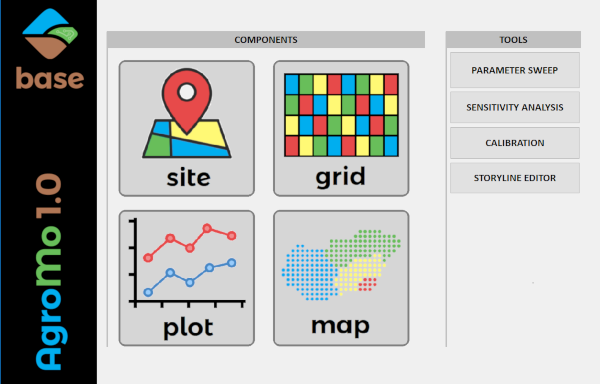
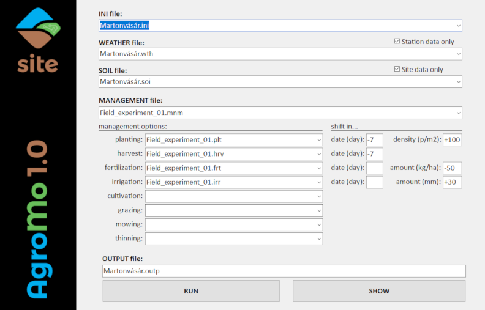

# AgroMo project

## Introduction

AgroMo is an Integrated Assessment and Modelling software that integrates the a CERES based crop model, the BiomeBGC-MuSo biogeochemical and a simple agro-economical model in order to support decision makers at multiple scales.

## AgroMo User Interface

A graphical user interface (GUI) has been developed for providing easy and user freindly access to the functions of the AgroMo system. When lunching the AgroMo App the user meets the AgroMo Base form first.

### AgroMo Base

- [ ] You may choose the main directory where your data files are located (in a fixed subdirectory system) by clicking the [CHOOSE] button.
- [x] You may go to the site specific component by clicking the [SITE] button.
- [x] You may create plots of the simulation results after clicking the [PLOT] button.
- [ ] You may create, open, edit and save your input files with the [INPUT FILE MANAGER] after clicking the corresponding button.

### AgroMo Site

- [x] The dropdown menus display the content of the corresponding directories within the input folder:
  - INI file (extension: .ini): .\input\initialization\
  - WEATHER file (extension: .wth): .\input\weather\site\
  - SOIL file (extension: .soi): .\input\soil\site\
  - MANAGEMENT file (extension: .mgm): .\input\management\
     - planting management option file (extension: .plt): .\input\management\planting\
     - harvest management option file (extension: .hrv): .\input\management\harvest\
     - fertilization management option file (extension: .frt): .\input\management\fertilization\
     - irrigation management optio file (extension: .irr): .\input\management\irrigation\
     - cultivation management option file (extension: .cul): .\input\management\cultivation\
     - grazing management option file (extension: .grz): .\input\management\grazing\
     - mowing management option file (extension: .mow): .\input\management\mowing\
     - thinning management option file (extension: .thn): .\input\management\thinning\
  - PLANT specific input files (extension: .pla; folder: .\input\plant\) are referred to in the planting management option files
- [x] Upon selecting an INI file the WEATHER, SOIL and MANAGEMENT files that are referred to in the INI file are automatically selected from the corresponding dropdown menus, but those could be changed freely.
- [ ] Upon selecting a MANAGEMENT file the management option files that are referred to in the MANAGEMENT file are automatically selected from the corresponding dropdown menus, but those could be changed freely.
- [ ] The most important parameters of the management options could be changed without accessing the management option file by adjusting the parameter values using the corresponding textboxes within the 'shift in...' section. The values can be set by typing or using the mouse scroll.
- [ ] OUTPUT id could be entered in the corresponding textbox. Output data are stored in the '.\output\site\' folder in an .RDS file, each run with different id. 
- [ ] After selecting the desired input files and set up the changes in the 'shift in...' section the simulation can be started by clicking the [RUN] button.
- [x] An activity indicator is on while the simulation is running. 
- [x] The simulation results can be presented on different type of graphs after clicking the [PLOT] button.
- [ ] Any other AgroMo component can be accessed directly by clicking the corresponding vertical label on the left side banner.
- [ ] WEATHER and SOIL input files containing artificial data (estimated or generated) can be indicated in the file name by including the 'art' string in the file name (e.g. Chicago_NOAA_station-art.wth). Files with observed values in the WEATHER and SOIL folder can be filtered out by checking in the corresponding check boxes. In case an 'observed data only' check box is checked input only the input files that does NOT include the 'art' string are presented in the WEATHER and/or SOIL dropdown menu.
